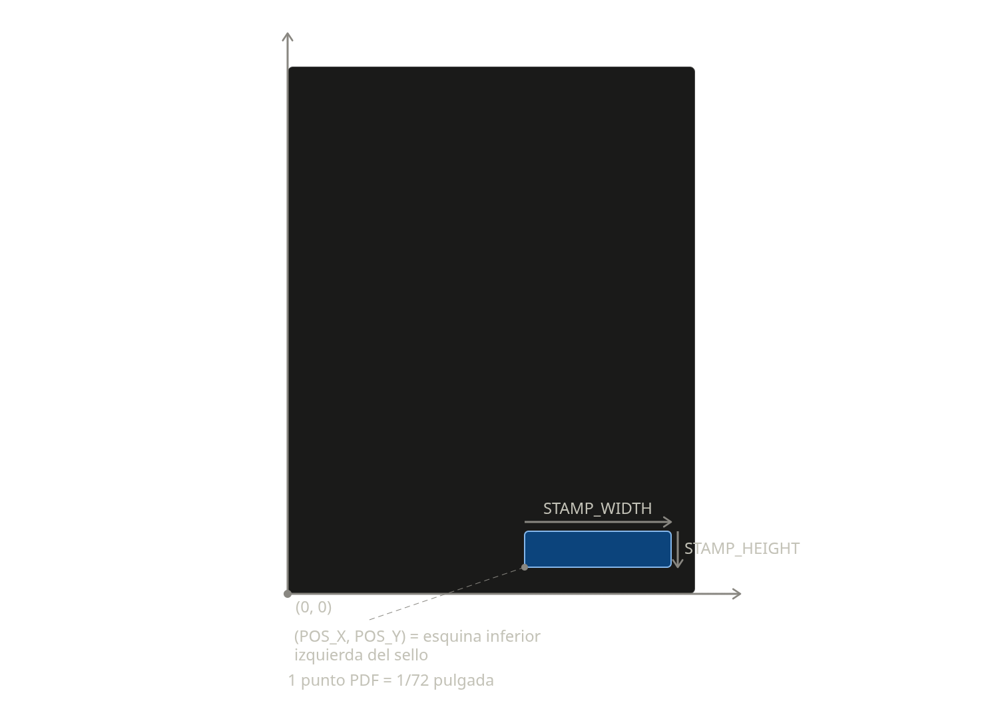

# Firmador PDF en masa

Firma digitalmente (PAdES) todos los PDFs de una carpeta usando un certificado
`.pfx`/`.p12`, estampando visualmente un sello con nombre, apellido y fecha de
firma generados automáticamente sobre una imagen de plantilla.

## 1. Instalación

**Requisitos**: Python 3.10 o superior.

```bash
git clone git@github.com:AquaroTorres/firmador-pfx.git
cd firmador-pfx
python3 -m venv .venv
source .venv/bin/activate
pip install -r requirements.txt
```

**Coloca tus archivos**:

- Certificado digital en `certs/tu-certificado.pfx`.
- Imagen de la firma (plantilla) en `assets/tu-firma.png`.
- Copia `config.env.example` a `config.env` y ajusta las rutas y valores a los tuyos:

```bash
cp config.env.example config.env
```

`config.env` **no se sube a git** (está en `.gitignore`) porque referencia tu
certificado y tus datos personales — cada persona/organización mantiene el suyo.

**Empaquetado opcional** (para distribuir sin que el usuario final instale Python):

```bash
pip install -r requirements-build.txt
pyinstaller --onefile --name firmador firmador.py
```

Esto genera `dist/firmador` (Linux). Para Windows, el mismo comando debe
ejecutarse en una máquina Windows — PyInstaller no puede cross-compilar desde
Linux. El binario espera `config.env`, tu certificado y tu imagen de firma
junto a él (rutas relativas al propio ejecutable, no al directorio desde el
que se invoque).

## 2. Uso

1. Coloca los PDFs a firmar en `in/`.
2. Ejecuta:

   ```bash
   python3 firmador.py
   ```

   (o `./dist/firmador` si usas el binario empaquetado).
3. Te pedirá la clave del certificado de forma interactiva (no queda visible
   en pantalla ni se guarda en ningún archivo). También puedes pasarla con
   `--password`.
4. Los PDFs firmados quedan en `out/`, con el mismo nombre que en `in/`. Al
   final se imprime un resumen `[OK]`/`[ERROR]` por archivo.

**Parámetros de línea de comandos** (sobrescriben lo definido en `config.env`
sin tener que editarlo):

| Flag | Equivale a | Descripción |
|---|---|---|
| `--config RUTA` | — | Usar otro archivo de configuración |
| `--password CLAVE` | — | Clave del PFX (si no se pasa, se pide por teclado) |
| `--sign-page` | `SIGN_PAGE` | Página a firmar: número (1-based) o `last` |
| `--pos-x` / `--pos-y` | `POS_X` / `POS_Y` | Posición del sello en la página |
| `--stamp-width` / `--stamp-height` | `STAMP_WIDTH` / `STAMP_HEIGHT` | Tamaño del sello en la página |

### Coordenadas y tamaño del sello

`POS_X`/`POS_Y`/`STAMP_WIDTH`/`STAMP_HEIGHT` (en `config.env`) ubican el sello
**dentro de la página del PDF**, en puntos PDF (72 puntos = 1 pulgada), medidos
desde la **esquina inferior izquierda de la página**:



- `POS_X`/`POS_Y` = esquina inferior izquierda del sello.
- `STAMP_WIDTH`/`STAMP_HEIGHT` = ancho y alto del sello, creciendo hacia la
  derecha y hacia arriba desde ese punto.

**Importante — proporción de la imagen**: `STAMP_WIDTH`/`STAMP_HEIGHT` deben
mantener la misma relación de aspecto (ancho:alto) que tu imagen real en
`IMAGE_PATH`, porque el sello se ajusta exactamente a esa caja sin recortar ni
preservar proporciones automáticamente — si no coinciden, la imagen se ve
estirada o achatada. La plantilla incluida (`assets/firma-template.png`) mide
754×185 px (relación ≈ 4,08:1); por eso el ejemplo en `config.env.example`
usa `STAMP_WIDTH=180` / `STAMP_HEIGHT=44` (relación ≈ 4,09:1). Si usas tu
propia imagen, calcula `STAMP_HEIGHT = STAMP_WIDTH / (ancho_px / alto_px)`.

Aparte, dentro de esa misma imagen se dibujan 3 líneas de texto en píxeles de
la imagen (no de la página): nombres y apellidos (mismo tamaño,
`NAME_FONT_SIZE`, apilados uno debajo del otro desde `NAME_POS_X`/`NAME_POS_Y`)
y la fecha de firma (tamaño independiente `DATE_FONT_SIZE`, normalmente menor,
desde `DATE_POS_X`/`DATE_POS_Y`), con el huso horario local agregado
automáticamente (ej. `2026-08-05 18:59:04 -04:00`).

## 3. Tecnología usada

- **[Python](https://www.python.org/)** 3.10+
- **[pyHanko](https://github.com/MatthiasValvekens/pyHanko)** — firma digital PAdES con certificados PKCS#12 (`.pfx`) y estampado visual
- **[Pillow](https://python-pillow.org/)** — composición del sello (nombre, apellido y fecha sobre la imagen de plantilla)
- **[pypdf](https://pypdf.readthedocs.io/)** — lectura de metadatos del PDF (conteo de páginas) y detección de archivos corruptos
- **[python-dotenv](https://github.com/theskumar/python-dotenv)** — parseo del archivo de configuración `config.env`
- **[PyInstaller](https://pyinstaller.org/)** — empaquetado como ejecutable standalone (sin requerir Python instalado)
